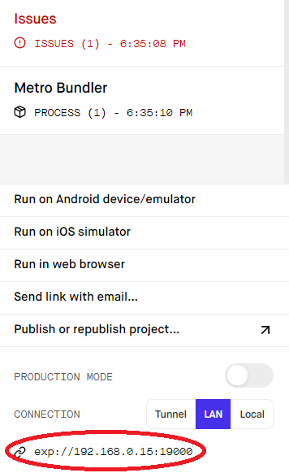

<h1 align="center">
    
</h1>

<h4 align="center">
  🚀 Semana Omnistack 9
</h4>

<p align="center">
 

  
</p>

<p align="center">
  <a href="#rocket-tecnologias">Tecnologias</a>&nbsp;&nbsp;&nbsp;|&nbsp;&nbsp;&nbsp;
  <a href="#-projeto">Projeto</a>
</p>

## :rocket: Tecnologias

Esse projeto foi desenvolvido com as seguintes tecnologias:

- [Django](https://www.djangoproject.com/)
- [Django-Rest-Framework](https://www.django-rest-framework.org/)
- [Cloudinary](https://cloudinary.com/)
- [React](https://reactjs.org)
- [React Native](https://facebook.github.io/react-native/)
- [Expo](https://expo.io/)

## 💻 Projeto

## Instalação
### Para o backend, é necessário ter o Python instalado em sua máquina. De preferência 3.6 para cima.

Primeiro:
- Abrir env_example.py
- Editar esse arquivo conforme o que está escrito nele
- Renomear para env.py

No terminal, rodar:
```sh
cd backend_django
python -m venv venv
. venv/Scripts/activate
pip install -r requirements.txt
python manage.py runserver SEU_IP
```
Repectivamente:
- Para entrar na pasta dos arquivos do backend
- Criar um ambiente virtual
- Ativar o ambiente virtual
- Instalar todos os pacotes necessários para rodar a aplicação
- Rodar API
##### Esse SEU_IP é seu IPv4 encontrado no terminal com ipconfig/all ou também quando executar expo start no mobile.
<h1 align="center">
  
</h1>

##### Necessário para o seu pc servir os dados da API para os dispostivos da sua rede.
Deixe o runserver rodando, ele é a API que fornecerá as informações


##OBS:
Usei o cloudinary para salvar as imagens dos Spots.

### Para o frontend é necessário ter o node e o yarn instalados na máquina
No terminal, rodar:
```sh
cd web
yarn start
```
Repectivamente:
- Para entrar na pasta dos arquivos do frontend
- Instalar os pacotes do projeto e rodar

Depois:
- Abrir api.js e adicionar o endereço da sua API (Ex: 192.168.0.1)


### Para o mobile é preciso ter o node, yarn e expo instalados na máquina e ter o expo instalado no celular
Fica melhor rodar no celular para não comer a memória do pc com emulador
No terminal, rodar:
```sh
cd mobile
expo start
```

Repectivamente:
- Para entrar na pasta com os arquivos do mobile
- Instalar pacotes do projeto e rodar

Depois:
- Abrir api.js e adicionar o endereço da sua API


